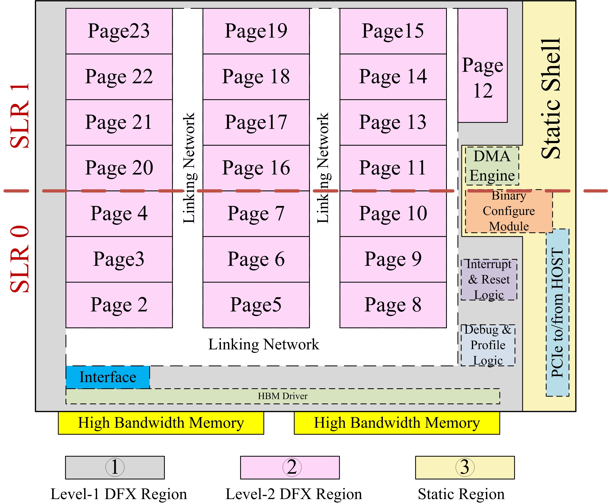
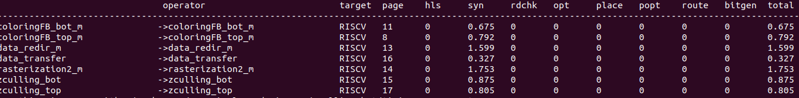

# PLD 
## 1 Introduction
PLD (**P**artition **L**inking and Loa**D**ing on **P**rogrammable **L**ogic **D**evices) is a top-level 
tool, that allows the developers migrate applications from pure software to hydrid-
or pure-hardware running on the FPGAs. It provides different options that tradeoff
compile time with performance as below.
- -O0: Map all the operators to software cores ([PicoRv32](https://github.com/cliffordwolf/picorv32)).
- -O1: Map all the operators to [DFX](https://www.xilinx.com/support/documentation/sw_manuals/xilinx2021_1/ug909-vivado-partial-reconfiguration.pdf) regions.
- -O3: Map all the operators as a whole application on pure FPGA fabrics.
 
PLD is based on [Vitis](https://www.xilinx.com/support/documentation/sw_manuals/xilinx2021_1/ug1400-vitis-embedded.pdf)
and [RISC-V tool chains](https://github.com/riscv-collab/riscv-gnu-toolchain).
When C++ application are developed in the form of dataflow computational 
graph, PLD can map streaming operators within the application to a pre-defined 
overlays and performs fast compilation. As an initial functional implementation, 
PLD can map the C/C++ applications to RISC-V cores clusters within seconds for 
quick functionality verfication and debugging. After that, the users can change 
the operators mapping targets by only changing some pragmas, the PLD only compiles 
the changed operators in parallel. PLD can run both on local machine and 
google cloud platform (GCP). When run PLD on the local machine, the Makefile 
can explore the maximum parallelism  by the maximum local threads. When running 
the PLD on the google cloud platform, we use [Slurm](https://cloud.google.com/architecture/deploying-slurm-cluster-compute-engine)
as the scheculer to parallelize 
independent compilation jobs. In the following sections, we will show you how to 
use PLD for incremental development by mapping **Rendering** from [Rosetta Benchmark](https://github.com/cornell-zhang/rosetta), 
both with local macine and [GCP](https://cloud.google.com/).

### 1.1 How PLD works?
To use PLD to develop the benchmarks, the application code should be written in the form 
of dataflow graph. We take the [rendering](input_src/rendering512) example as below.

  

Figure 1: Dataflow Computing Graph for rendering

It has 7 operators. Each operator has an individual .cpp and .h file. The Makefile
will detect wether these .cpp or .h files have been ever changed, and only lauch 
corresponding compilation jobs either locally or on the goole cloud. As the figure
below, all the 7 operators compilations jobs are idependent and can be performed 
in parallel. Accroding to the opertor's header file, the operators can be mapped
to FPGA Fabric or pre-compiled RISC-V cores. As shown in the data_transfer.h Line 3,
data_transfer operator's target is hardware (HW), the data_transfer.cpp will be compiled
by the Vitis_HLS to generate the verilog files. Out-of_context synthesis can compile
the Verilog files to DCP files. The overlay is pre-compiled DCP, which are
equipped with RISC-V cores on all the Partical Reconfigurable pages. It obays the 
normal partial reconfigration flow from Xilinx. After the overlay is implemented
(Placed and routed), we empty the paritial reconfigurable pages out, and store the 
corresponding bitstreams as a RISC-V library. 

If the operator target HW, the pragam direvative p_num can specify which leaf to 
map (data_transfer.h L3). The overlay will first be loaded, and fill in the target 
leaf with the flow_calc.dcp and do the placement and routing under the context of
the overlay. After that, the partial bitstream will be generated.

If the operator taget is RISCV, the data_redir.cpp will be passed through RISC-V
tool chain and generate the ELF (Executable and Linkage File) without any hardware
compilation. It usually takes around seconds.    


Figure 2: PLD Flow and C++ Templete Code


## 2 Tool Setup

### 2.1 Vitis Preparation
The demo is developed with [Vitis 2021.1](https://www.xilinx.com/support/download/index.html/content/xilinx/en/downloadNav/vivado-design-tools/2021-1.html) 
and [Alveo U50](https://www.xilinx.com/products/boards-and-kits/alveo/u50.html).


### 2.2 RISC-V Tool Praparation

The RISC-V toolchain is based on [picorv32](https://github.com/YosysHQ/picorv32) repo.
You can install the RISC-V toolchain from
the [official website](https://github.com/riscv-collab/riscv-gnu-toolchain).
We copy the installation guide from [picorv32](https://github.com/cliffordwolf/picorv32) 
as below.

    git clone https://github.com/riscv/riscv-gnu-toolchain
    cd ./riscv-gnu-toolchain
    ./configure --prefix=/opt/riscv --with-arch=rv32gc --with-abi=ilp32d
    make

## 3 Benchmark Preparation
1. To get our [Makefile](./Makefile) to work, you need to copy your application cpp
code to certain directory. We take 
**Rendering** as an example.
2. You can create the directory [rendering512](./input_src) with the same 
name as the benchmark under '**./input_src**'.
3. We create one cpp file and one header file for each operator. In 
[./input_src/rendering512/operators](./input_src/rendering512/operators), we
can see 7 operators to be mapped to partial reconfigurable pages.
4. We can set the page number and target (HW or RISC-V) in the header file
for each [operator](input_src/rendering/operators/data_redir_m.h).

```c
    #pragma map_target = HW page_num = 3 inst_mem_size = 65536
```

5. Currently, we use a **top** function in [./input_src/rendering512/host/top.cpp](./input_src/rendering512/host/top.cpp)
to show how to connect different operators together. Our python script 
([runtime.py](./pr_flow/runtime.py)) will
parse the top.cpp and operator header files to extract the interconnection,
and generate the configuration packets.
 

## 4 Tutorial 1: X86 C++ Simulation
1. We can start from the local C++ code. Go to [./input_src/rendering512](./input_src/rendering512).
2. In the [Makefile](./input_src/rendering512/Makefile), we need to modify the 
include path, which corresponds to the your installation path.

```c
INCLUDE=-I /opt/Xilinx/Vivado/2021.1/include 
```

3. type **make** do simulate the source C++ code with gcc. You should see the results as below.


Figure 3: C++ Simulation on X86 machines


## 5 Tutorial 2: Initial Hardware Implementation
1. After the C++ implementation, we will launch our first trial to map the 9 operators
to hardware page.

2. Type **make report**, you can see the each operator is mapped to one physical 
page, but currently, no hardware implementation details are available.
The overlay size is as below.


*(These images aren't coming up inline in the anonymizer; click on the link text to see the image.)*

3. As you set the vivado properly, we need to set the **Xilinx_dir**, which represents
the vivado installtion diretory in 
[./common/configure/configure.xml](./common/configure/configure.xml).

```c
  <spec name = "Xilinx_dir" value = "/opt/Xilinx/Vivado/2018.2/settings64.sh" />
```

4. In the [Makefile](./Makefile), change the **prj_name** to **optical_flow**.

```c
    prj_name=optical_flow
```

5. Now we are ready to launch the first hardware implementation trial. Type 
**make -j$(nproc)** to take advantage of multi-threads of your local CPU.
However, you need to have enough DDR memory to explore the parallel compilation.
The safe ratio between DDR memory and CPU threads is 4 GBs/threads. For example, 
if you have 8 threads-CPU, the safe DDR memory size is around 32 GBs. 

6. After all the compilations are done, we can see one of the pages (flow_calc) 
consumes 56,683 LUTs, and is too big 
to be mapped. By typing **make report**, you can see the detailed implementation information in the terminal.
You can also read the report under **./workspace/report**.


*(These images aren't coming up inline in the anonymizer; click on the link text to see the image.)*


## 6 Tutorial 3: Map all the operators to RISC-V
1. The 20 partial reconfigurable pages are pre-loaded with one picorc32 cores.
To make sure the RISC-V core can run 'ap_int.h' and 'ap_fixed.h', the 
smallest bram size it 65536 Bytes. We could easily map 9 opertors out of 20
pre-load 16 RISC-V cores.


*(These images aren't coming up inline in the anonymizer; click on the link text to see the image.)*

2. We are going to switch '**data_redir**' page to RISC-V. To achieve
this goal, we only need to avoid downloading any partial bitstreams to
page 3 and use ARM to send instruction data through BFT to the pre-loaded
RISC-V core. 

3. As the user, we need to change the pragma in [operators' header files](./input_src/optical_flow/operators).

```c
    #pragma map_target = riscv page_num = 3 inst_mem_size = 65536
```

4. As we have alread set the RISC-V toolchain before, we need to specify the 
**riscv_dir** feature.

```c
<spec name = "riscv_dir" value = "/opt/riscv32" />
```

5. By typing **make -j$(nproc)**, the RISC-V elf file will be compiled automatically.
Type **make report**, you can see the comipile time details in the terminal.


*(These images aren't coming up inline in the anonymizer; click on the link text to see the image.)*

6. As all the RISC-V ELF files are ready, we can launch the soft-run with Xilinx SDK. 

```c
    # copy the hdf file to specific dir:
    mkdir -p ./workspace/sdk
    cp ./common/overlay/floorplan_static_wrapper.hdf ./workspace/sdk/
```

7. Launch sdk 2018.2, specify the workspace directory to the DIR with the 'floorplan_static_wrapper.hdf'
as below.


*(These images aren't coming up inline in the anonymizer; click on the link text to see the image.)*

8. Create an application projets as below.


*(These images aren't coming up inline in the anonymizer; click on the link text to see the image.)*

9. Click **new** to specify the hdf file.


*(These images aren't coming up inline in the anonymizer; click on the link text to see the image.)*

10. Click **new** to specify the hdf file directory as below.


*(These images aren't coming up inline in the anonymizer; click on the link text to see the image.)*

11. Create the application with the same name as the benchmark.


*(These images aren't coming up inline in the anonymizer; click on the link text to see the image.)*

12. Type '**Make config**", the instr_data will make copied to Vitis project,
and the cpp source will also be updated.

13. Fresh the source files. If you set the sdk application projets with the right
direcotry and name, you should see the source files are updated automatically by 
previous step.


*(These images aren't coming up inline in the anonymizer; click on the link text to see the image.)*


14. Type '**Make download**' to download the bitstreams into the board,
and launch the SDK project to run the project. You can see the results
with one page running on the RISC-V core.


*(These images aren't coming up inline in the anonymizer; click on the link text to see the image.)*


## 7 Tutorial 4: More Debugging Features for RISC-V implementation
1. We can enable the print features by changing the 
[./input_src/optical_flow/operators/flow_calc.cpp](./input_src/optical_flow/operators/flow_calc.cpp)
as below. The **print_str** and **print_dec** are the functions in the RISC-V firmware.

```c
#ifdef RISCV
      print_str("r=");
      print_dec(r);
      print_str("\n");
#endif
```

2. Compile the projects again by steps below.

```
    # re-compile RISC-V cores
    make -j$(nproc)
    make config
    make download
```

3. Go back to the SDK projects can re-launch the ARM run. You can see the debugging
information as below. We can see it takes around 18 seconds to process one rows of
frames. We will use faster RISC-V cores to accelerate the image processing in the future.


*(These images aren't coming up inline in the anonymizer; click on the link text to see the image.)*


## 8 Tutorial 5: Map all Operators to Hardware

1. By looking into the **flow_calc** operator in Figure 1, we find the nested 
loop calculation is suitable for data-parallelism. Especially, **buf[0]**
and **buf[1]** are completely independent (L24--26).  Therefore, we can 
split the computation into two operators. 
Consequently, we can also easily split the upstream 
operators **tensor_y**, **tensor_x**, **product**, **weight_x**,
 **weight_y** in similar way, so that we can benefit from smaller
pages to accelerate the compilation time.
For operators **unpack**, **grad_xy**, **grad_z**, we 
can see they are small, and  
we can merge them into one operator without
harming the performance.
As we split each operator, we can
compile it quickly in 2 s and run the split design on the softcore
processors along with the already FPGA-page-mapped operators to validate
functionality.  
After decomposing and merging the operators, we have 16  operators that all fit
on the pages on our overlay, and the entire design runs on FPGA logic.  


*(These images aren't coming up inline in the anonymizer; click on the link text to see the image.)*


3. We have our decomposed C++ code under [./input_src/optical_flow_final/](./input_src/optical_flow_final).
We can change the project name to **optical_flow_final**.

```c
prj_name=optical_flow_final
```

4. Type '**Make -j$(nproc)**'. It will generate all the necessary DCP and 
bitstream files automatically. Different operators can be compiled in 
parallel according to the thread number of your local machine. Be carefull
with the memory requirements, when you use multi-threads to compile the 
project. When I use 8 threads to compile, I at least need 32 GB DDR 
memory.

```c
Make -j$(nproc)
```


## 6 Mapping Report
Type '**Make report**', you can find the compile and resource report under 
'workspace/report'.

## 7 Google Cloud Platform Compilation
1. You need a goole account to use Google Cloud Platform (GCP) from compilation.
For personal use, you should have $300 free trial when you register our GCP account.
2. Click **Console** on the top right, and create a project.


*(These images aren't coming up inline in the anonymizer; click on the link text to see the image.)*


*(These images aren't coming up inline in the anonymizer; click on the link text to see the image.)*


3. Click **Compute Engine->VM instances**. 


*(These images aren't coming up inline in the anonymizer; click on the link text to see the image.)*

4. For the first time, you may need to enable the API function.


*(These images aren't coming up inline in the anonymizer; click on the link text to see the image.)*


5. [This](https://github.com/SchedMD/slurm-gcp) github repo explains how to set up
slurm computation clusters. For simplicity, we just use GCP marketplace to create
our slurm clusters. Click **Launch**.


*(These images aren't coming up inline in the anonymizer; click on the link text to see the image.)*


6. Fill out the project names.


*(These images aren't coming up inline in the anonymizer; click on the link text to see the image.)*

7. Check **Login External IP** and **Compute Node External IP**.


*(These images aren't coming up inline in the anonymizer; click on the link text to see the image.)*

8. Increase the **Slurm Controller Boot Disk Size** to 400GB.


*(These images aren't coming up inline in the anonymizer; click on the link text to see the image.)*

9. For **Slurm Compute Partition 1**, you can set **Maximum Instance Count** to 100,
and **Number of static nodes to create** to 1 for future use.


*(These images aren't coming up inline in the anonymizer; click on the link text to see the image.)*

10. For this tutorial, 1 partition is enough. Click **Deploy**.
11. Click **Compute Engine->VM instances**. You should see 3 nodes are up (contorller, login0 and compute-0-0).


*(These images aren't coming up inline in the anonymizer; click on the link text to see the image.)*

12. Next, we need to install Xilinx Vitis Tool chain on GCP. We recommend to use GUI
mode to install xilinx tools. We will install the controller node with VNC, so that
users can log into the cluster with graphic mode.

13. As slurm cluster use CentOS7 as the grid machine, [this video](https://www.youtube.com/watch?v=psWg-kIPs3U)
and [this link](https://docs.microsoft.com/en-us/archive/blogs/microsoft_azure_guide/how-to-enable-desktop-experience-and-enable-rdp-for-a-centos-7-vm-on-microsoft-azure)
will be usefull for you. For simplicity, we will also walk you though the steps to set up VNC on the controller node.

14. Click **SSH** to log into the controller from our browser. Execute the commands below in the terminal.
It may take a while to execute all the commands. Click yes when you are prompted to 
make deicisions.

```c
sudo -s
rpm -Uvh http://li.nux.ro/download/nux/dextop/el7/x86_64/nux-dextop-release-0-1.el7.nux.noarch.rpm
yum groupinstall "GNOME Desktop" "Graphical Administration Tools"
ln -sf /lib/systemd/system/runlevel5.target /etc/systemd/system/default.target
yum -y install xrdp tigervnc-serversystemctl 
systemctl start xrdp.service
netstat -antup | grep xrdp
systemctl enable xrdp.service
```
15. Next, execute the commands below in the terminal.
If you get errors like **firewallD is not running**, go to step 16.
Otherwise, go to step 17.

```c
firewall-cmd --permanent --zone=public --add-port=3389/tcp
firewall-cmd --reload
```
16. [This link](https://www.liquidweb.com/kb/how-to-start-and-enable-firewalld-on-centos-7/)
 shows you how to set launch the firewall. Or you can execute commands below. 
Then go back to step 15 to config the firewall.

```c
systemctl unmask --now firewalld
systemctl enable firewalld
systemctl start firewalld
systemctl status firewalld
```

17. Set a root password for remote login.

```c
passwd
```

18. You have set up the VNC on the controller size. Now download a Microsoft Remote Desktop
on our local machine. Type in the IP address of the GCP controller, and launch 
the remote control with ID:root and password you just set. Now you have GUI for 
the controller machine. Install Xilinx Vitis 2020.2 to /apps directory.


*(These images aren't coming up inline in the anonymizer; click on the link text to see the image.)*


19. After Vitis is installed, you can change the ./common/configure/configure.xml
file's specifications as below.

```c
<spec name = "Xilinx_dir"         value = "/apps/xilinx/Vivado/2020.2/settings64.sh" />
<spec name = "back_end"           value = "slurm" />
```
20. Log into the 'login0' machine, and type **make** to launch the GCP compilation.
After the compilation is done, type **make report** to see the compilation results.


